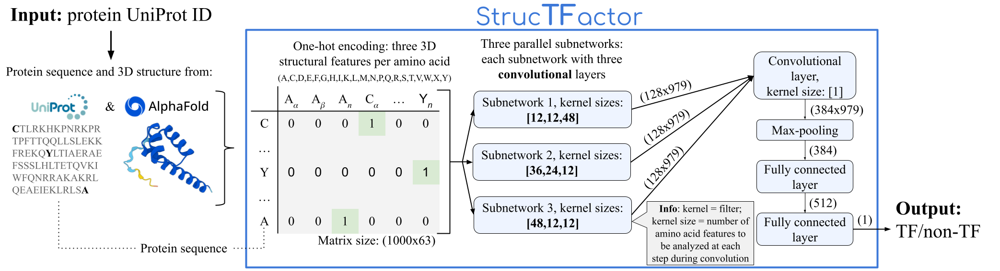

# Transcription factor prediction using protein 3D structures


## Abstract
Motivation: Transcription factors (TFs) are DNA-binding proteins that regulate expressions of genes in an organism. Hence, it is important to identify novel TFs. Traditionally, novel TFs have been identified by their sequence similarity to the DNA-binding domains (DBDs) of known TFs. However, this approach can miss to identify a novel TF that is not sequence similar to any of the known DBDs. Hence, computational methods have been developed for the TF prediction task that do not rely on known DBDs. Such existing methods use protein sequences to train a machine learning model, in order to capture sequence patterns of known TFs, and then use the trained model to predict novel TFs. Because 3-dimensional (3D) structure of a protein captures more functional characteristics of the protein than its sequence, using 3D protein structures can more correctly predict novel TFs.

Results: We propose a protein 3D structure-based deep convolutional neural network pipeline (named _StrucTFactor_) for TF predictions and compare it with the existing state-of-the-art TF prediction method that relies only on protein sequences. We use 12 datasets capturing different aspects of data bias (including sequence redundancy and 3D protein structural quality) that can influence the training of a machine learning model, spanning ~550,000 proteins. We find that, over all datasets, StrucTFactor significantly (_p_-value < 0.001) outperforms the existing state-of-the-art method for TF prediction, showing performance differences of up to 23% based on Matthews correlation coefficient. Our results show the importance of using 3D protein structures in the TF prediction task. We provide the StrucTFactor computational pipeline for the scientific community.

## Software / Hardware prerequisites
Before you begin, ensure that you have the following prerequisites installed on your system:
- [Anaconda](https://www.anaconda.com/products/distribution) or [Miniconda](https://docs.conda.io/en/latest/miniconda.html)
- `pip` package manager
- `python` >=3.6.12

Models have been trained on a single Tesla T4 GPU.

## Installation Steps
Given CUDA version 12.2, the following installation guide was tested.

### 1. Clone the repository
```bash
git clone https://github.com/lieboldj/StrucTFactor.git
```

### 2. Create a conda environment
```bash
conda env create -f stf.yml
conda activate stf
```
If you want to benchmark with DeepReg, please install tensorflow.

## Predict TF/non-TF for a pdb file
Given a pdb file, you run the following to predict whether this protein is a TF: 
```bash
cd strucTFactor
python predictTFwithStrucTFactor.py -i <pdb_file>
```
The result will be printed in your terminal and written in _output.csv_.

## Reproducing results in paper
### Option 1: Download complete dataset:
Download it via:
```bash
python download_data.py
```

Extract via terminal:
```bash
unzip pre-trained_models.zip
unzip datasets.zip
```
You will find the folders data/ and results/

### Option 2: Create datasets by running the following script:
```bash
cd scripts/data_preparation
./create_datasets.sh
```
We recommand to download the datasets, because the runtime is >3 hours (including DSSP for all AlphaFold structures and analysis of the dataset).
This procedure includes the download of uniprot_sprot.dat.gz and all steps to create the datasets (see scripts/data_preparation).

### Run our experiments:
After you got or created all data, you can easily execute our method and reproduce the results:
```bash
cd strucTFactor
./run_cross_val.sh
```
Here, you can execute the programm of your choice (```./run_all_data.sh```, ```./run_cross_val.sh```, ```./run_explain_AI.sh```). Our five-fold cross validation is executed with ```./run_cross_val.sh```. 

## License
This work is licensed under a Creative Commons Attribution 4.0 International Public License.

## Reference
Neuhaus F., Liebold J, Geiser J, Kurtz S, Baumbach J, Newaz K (2024). Transcription factor prediction using protein 3D secondary structures.


*Corresponding author:*

Khalique Newaz, khalique.newaz@uni-hamburg.de
